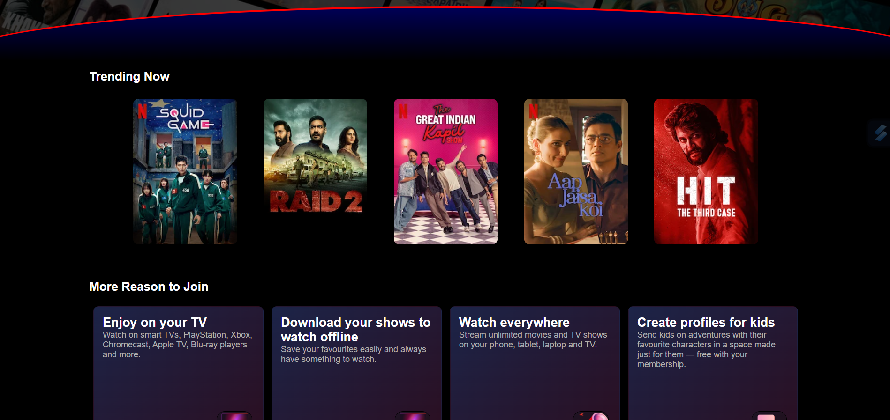

# 🎬 Netflix Landing Page Clone

A pixel-perfect, clone of the Netflix landing page built using **HTML**, **CSS**. This project replicates the real Netflix homepage UI for learning and showcasing front-end development skills.

---

##📚 Learning Goals
This project was built to:

  -Practice HTML & CSS layout skills

  -Mimic real-world, production-level UIs

  -Understand design systems used by top platforms

  -Strengthen frontend design confidence
  
---

##🚀 Future Ideas

- Add responsive UI to it.
- Add Javascript Function for button actions.


---

## 📸 Screenshots

### ✅ My Clone:
![Clone Screenshot]



### 🔴 Netflix Original Reference:
![Original Screenshot]


---


## 🛠️ Tech Stack

- HTML5
- CSS3 (Flexbox, Grid, custom styling)

---

## 🚀 Features

- Styled email input and "Get Started" button
- Background image flex with dark overlay effect
- Section divider with custom curve styling
- Typography and spacing similar to the real Netflix landing page
- Clean code structure for easy modification

---

## 📦 How to Run Locally

```bash
# 1. Clone the repository
git clone https://github.com/yourusername/netflix-clone.git

# 2. Navigate into the folder
cd netflix-clone

# 3. Open with Live Server or just double-click index.html
```

##📄 License

This is a personal project for learning purposes only.
Netflix™ and all related content are trademarks of Netflix Inc.
